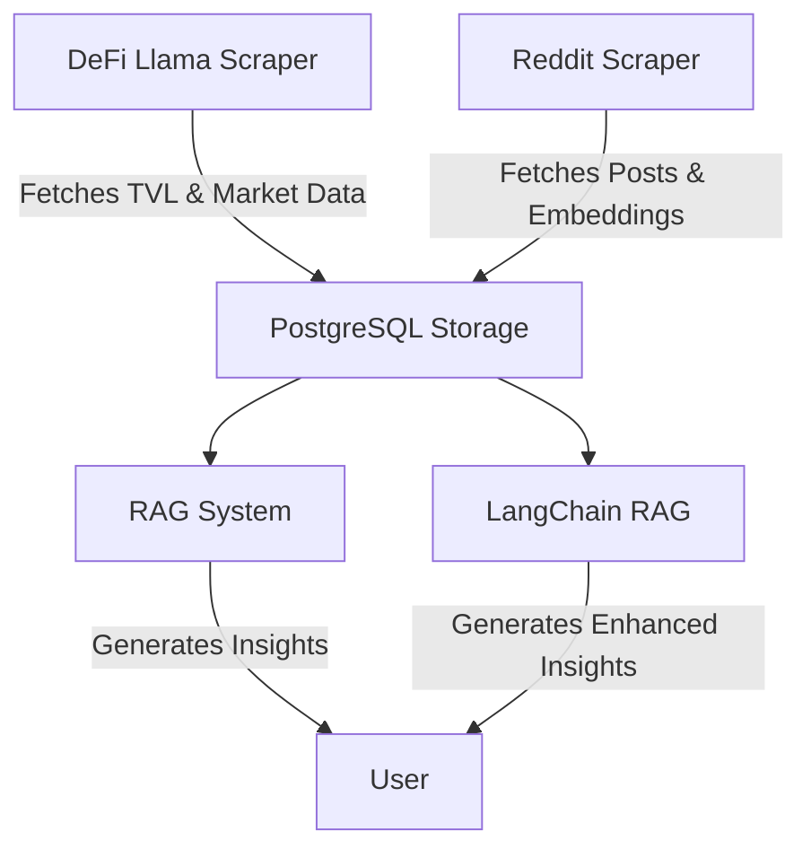

# Crypto Data Engineering

This repository contains tools for collecting, processing, and analyzing cryptocurrency data from various sources.

## Features

- **Multiple Data Sources**: Integration of DeFi Llama API, CoinMarketCap API, and Reddit data
- **Advanced RAG Implementation**: Using LangChain for modular and extensible RAG capabilities
- **Data Lineage Tracking**: Comprehensive tracking of data flow and transformations
- **Docker Containerization**: Full containerization for easy deployment and testing
- **CI/CD Pipeline**: Automated testing and deployment using GitHub Actions
- **DeFi Llama Integration**: Fetches Total Value Locked (TVL) metrics for blockchain networks
- **CoinMarketCap Integration**: Retrieves market data including prices, volumes, and market caps
- **Reddit Data Scraping**: Collects posts from cryptocurrency subreddits with OpenAI embeddings
- **PostgreSQL Storage**: Structures and stores data in a PostgreSQL database
- **Automated Workflows**: Uses GitHub Actions for scheduled data collection
- **LangChain RAG Implementation**: Leverages LangChain for modular, extensible RAG capabilities
- **Interactive Example**: User-friendly interface for interacting with the RAG system
- **Multiple Cryptocurrencies**: Support for Bitcoin, Ethereum, Solana, and cryptocurrency topics like regulations, mining, and NFTs

## Technologies Used

### Core Technologies
- **LangChain**: Framework for building applications with LLMs [Documentation](https://python.langchain.com/docs/get_started/introduction)
- **PostgreSQL with pgvector**: Vector database for efficient similarity search [Documentation](https://github.com/pgvector/pgvector)
- **Docker**: Containerization platform [Documentation](https://docs.docker.com/)
- **OpenAI API**: For generating text embeddings [Documentation](https://platform.openai.com/docs/api-reference)

### Data Sources
- **DeFi Llama API**: For DeFi metrics and TVL data
- **CoinMarketCap API**: For cryptocurrency market data
- **Reddit API**: For social sentiment analysis

### Development Tools
- **GitHub Actions**: For CI/CD pipeline
- **Python**: Primary development language
- **SQLAlchemy**: Database ORM
- **FastAPI**: API framework

### Research Foundation
- **RAG Implementation**: Based on the work of Lewis et al. (2020) "Retrieval-Augmented Generation for Knowledge-Intensive NLP Tasks"

## Components

### 1. DeFi Llama Data Pipeline

The DeFi Llama pipeline collects TVL data and market metrics:

- **DefiLlama_scraper.py**: Fetches data from DeFi Llama and CoinMarketCap APIs
- **DefiLlama_to_postgresql.py**: Uploads processed data to PostgreSQL
- **check.py**: Verifies data quality and database connectivity

### 2. Reddit Data Pipeline

The Reddit pipeline collects and analyzes cryptocurrency discussions:

- **Reddit_scraper.py**: Fetches posts from r/cryptocurrency and generates embeddings
- Supports both normal and mock mode for testing
- **Data Storage**: Unstructured data, such as embeddings, is stored in PostgreSQL using the pgvector extension, allowing for efficient similarity searches and vector operations directly within the database.

### 3. Conversational RAG System

The Retrieval-Augmented Generation (RAG) system provides AI-powered cryptocurrency insights:

- **RAG.py**: Original implementation that retrieves and presents data
- **improved_RAG.py**: Enhanced version that generates conversational responses
- **langchain_rag.py**: Advanced implementation using LangChain for modular RAG
- **example_usage.py**: Interactive script for using the LangChain RAG implementation
- Uses OpenAI to create natural language answers based on retrieved data
- Combines structured market data with relevant Reddit discussions
- Supports mock mode for testing without API calls

#### LangChain RAG Features

The LangChain implementation provides several advantages:

- **Modular Architecture**: Easily swap out components like embeddings, retrievers, and LLMs
- **Advanced Query Capabilities**: Better retrieval of relevant documents through various similarity methods
- **Structured Prompting**: Enhanced prompt engineering through LangChain's prompt templates
- **Document Management**: Better handling of document metadata and content
- **Seamless PGVector Integration**: Direct integration with PostgreSQL vector storage
- **More Sophisticated Chains**: Build complex reasoning chains for improved responses
- **Multiple Interaction Modes**: Single query, batch processing, and interactive chat modes
- **Topic-Specific Responses**: Specialized responses for topics like regulations, NFTs, and mining

### 4. Migration Utilities

Utilities to help transition between implementations:

- **migrate_to_langchain.py**: Converts existing Reddit embeddings to LangChain PGVector format
- **compare_rag_implementations.py**: Compare the three RAG implementations side by side

## Setup and Installation

### Using Docker (Recommended)

1. Clone this repository:
   ```bash
   git clone https://github.com/yourusername/crypto-data-engineering.git
   cd crypto-data-engineering
   ```

2. Run the setup script to create the .env file and start the containers:
   ```bash
   chmod +x setup.sh
   ./setup.sh start
   ```

3. Use the setup script to run various components:
   ```bash
   # Run LangChain RAG with a query
   ./setup.sh langchain "What's the current price of Bitcoin?"
   
   # Run the example script in batch mode
   ./setup.sh example --batch
   
   # Run the example script in interactive mode
   ./setup.sh example --interactive
   ```

### Manual Setup

1. Clone this repository
2. Install dependencies:
   ```bash
   pip install -r requirements.txt
   ```
3. Create a `.env` file with the following environment variables:
   ```
   # API Keys
   cmc_api_key=your_coinmarketcap_api_key
   REDDIT_CLIENT_ID=your_reddit_client_id
   REDDIT_CLIENT_SECRET=your_reddit_client_secret
   REDDIT_USER_AGENT=your_reddit_user_agent
   OPENAI_API_KEY=your_openai_api_key

   # Database Configuration
   DB_HOST=your_database_host
   DB_PORT=your_database_port
   DB_NAME=your_database_name
   DB_USER=your_database_user
   DB_PASSWORD=your_database_password
   ```

4. Set up PostgreSQL with pgvector extension:
   ```sql
   -- Install the pgvector extension (requires PostgreSQL admin privileges)
   CREATE EXTENSION IF NOT EXISTS vector;
   
   -- Create reddit_embeddings table with vector column
   CREATE TABLE IF NOT EXISTS reddit_embeddings (
       post_id TEXT PRIMARY KEY,
       title TEXT,
       text TEXT,
       score INTEGER,
       num_comments INTEGER,
       created_utc TEXT,
       embedding TEXT,
       embedding_vector vector(1536)
   );
   
   -- Create LangChain PGVector collection table
   CREATE TABLE IF NOT EXISTS langchain_pg_embedding (
       uuid UUID PRIMARY KEY,
       collection_id TEXT NOT NULL,
       embedding vector(1536),
       document JSONB,
       cmetadata JSONB,
       custom_id TEXT
   );
   ```

## Usage

### DeFi Llama Data Collection

#### Example: Fetching and Storing TVL Data

1. Run the DeFi Llama scraper to fetch the latest TVL data:
   ```bash
   python DefiLlama_scraper.py
   ```
2. Upload the fetched data to PostgreSQL:
   ```bash
   python DefiLlama_to_postgresql.py
   ```
3. Verify the data integrity and connectivity:
   ```bash
   python check.py
   ```

### Reddit Data Collection

#### Example: Analyzing Cryptocurrency Discussions

1. Run the Reddit scraper to collect posts from cryptocurrency subreddits:
   ```bash
   python Reddit_scraper.py
   ```
2. Use mock mode for testing without API calls:
   ```bash
   python Reddit_scraper.py --mock
   ```

### Conversational Crypto Assistant

#### Example: Generating Insights with RAG

1. Run the original RAG system:
   ```bash
   python RAG.py --query "Bitcoin"
   ```
   
2. Run the improved RAG system:
   ```bash
   python improved_RAG.py --query "Ethereum"
   ```
   
3. Run the LangChain RAG system (recommended):
   ```bash
   python langchain_rag.py --query "Solana"
   ```
   
4. Test any of the systems in mock mode:
   ```bash
   python langchain_rag.py --mock --query "Ethereum"
   ```

### Interactive Example Usage

The example_usage.py script provides multiple ways to interact with the LangChain RAG system:

1. **Single Query Mode**:
   ```bash
   python example_usage.py --query "What is the current price of Bitcoin?"
   ```

2. **Batch Mode** (processes a set of predefined queries):
   ```bash
   python example_usage.py --batch
   ```

3. **Interactive Mode** (chat-like interface):
   ```bash
   python example_usage.py --interactive
   ```

### Migration and Comparison

1. Migrate existing Reddit embeddings to LangChain PGVector format:
   ```bash
   python migrate_to_langchain.py
   ```
   
2. Compare the three RAG implementations:
   ```bash
   python compare_rag_implementations.py --query "Ethereum" --full
   ```

### Using Docker

The project includes Docker support for easy deployment and testing:

1. Build and start the containers:
   ```bash
   docker-compose up -d
   ```

2. Run commands using the docker-compose:
   ```bash
   # Run LangChain RAG
   docker-compose run --rm app langchain-rag --query "Bitcoin"
   
   # Run the example script
   docker-compose run --rm app example --batch
   ```

3. Or use the provided setup.sh script:
   ```bash
   ./setup.sh langchain "Bitcoin"
   ./setup.sh example --interactive
   ```

## Automated Workflows

This repository includes GitHub Actions workflows that run on a schedule. To enable them:

1. Add all required secrets to your GitHub repository
2. The workflows will run automatically every 6 hours
3. You can also trigger them manually from the Actions tab

## Recent Improvements

- **Modular Code Design**: Refactored code into small, testable functions
- **Enhanced Error Handling**: Added robust error handling with informative messages
- **Proper Logging**: Implemented structured logging throughout the codebase
- **Data Validation**: Added data validation to ensure quality
- **Connection Management**: Improved database connection handling
- **Upsert Strategy**: Changed from replace to upsert to preserve historical data
- **Documentation**: Added comprehensive code comments and user documentation
- **LangChain Integration**: Added support for the LangChain MCP framework
- **Interactive Interface**: Created user-friendly interfaces for interacting with the RAG system
- **Extended Cryptocurrency Coverage**: Added support for multiple cryptocurrencies
- **Specialized Topic Handling**: Enhanced responses for topics like regulations, NFTs, and mining
- **Full Docker Support**: Improved containerization for easier deployment and testing

## Contributing

Contributions are welcome! Please feel free to submit a Pull Request.

# Project Goal

The primary goal of this project is to provide a comprehensive data engineering solution for collecting, processing, and analyzing cryptocurrency data from various sources. By integrating multiple data pipelines, the project aims to offer insights into market trends and discussions, enhancing decision-making for cryptocurrency enthusiasts and analysts.

# Visual Aids



# Comparing RAG Implementations

The project now includes three RAG implementations to demonstrate different approaches:

1. **Original RAG (RAG.py)**
   - Simple approach that retrieves and combines data
   - Limited conversation ability
   - Basic prompt construction

2. **Improved RAG (improved_RAG.py)**
   - Enhanced retrieval with better similarity search
   - Improved conversation with more context
   - Data lineage tracking

3. **LangChain RAG (langchain_rag.py)**
   - Modular components that can be swapped out
   - Advanced retrieval using PGVector
   - Sophisticated prompt engineering
   - Better document handling and metadata management
   - Seamless integration with various LLMs

# Detailed Examples

## DeFi Llama Data Collection

### Example: Fetching and Storing TVL Data

1. Run the DeFi Llama scraper to fetch the latest TVL data:
   ```bash
   python DefiLlama_scraper.py
   ```
2. Upload the fetched data to PostgreSQL:
   ```bash
   python DefiLlama_to_postgresql.py
   ```
3. Verify the data integrity and connectivity:
   ```bash
   python check.py
   ```

## Reddit Data Collection

### Example: Analyzing Cryptocurrency Discussions

1. Run the Reddit scraper to collect posts from cryptocurrency subreddits:
   ```bash
   python Reddit_scraper.py
   ```
2. Use mock mode for testing without API calls:
   ```bash
   python Reddit_scraper.py --mock
   ```

## Conversational Crypto Assistant with LangChain

### Example: Using the LangChain RAG Implementation

```python
from langchain_rag import CryptoRAGSystem

# Initialize the RAG system
rag = CryptoRAGSystem()

# Get an answer to a crypto question
response = rag.chat("What's happening with Ethereum lately?")

# Print the response
print(response)
```

## Testing

### Database Vector Search Testing

To verify that the pgvector extension is properly installed and working:

```bash
# Run the pgvector test script
python test_pgvector.py
```

This script:
1. Checks if the pgvector extension is installed
2. Verifies the table schema has vector columns
3. Tests vector search functionality with a sample query
4. Outputs detailed logs of each step

### Reddit Scraper Testing

```bash
# Run the Reddit scraper tests
python test_reddit_scraper.py
```

## System Requirements

- **Python**: 3.8 or higher
- **PostgreSQL**: 14.0 or higher with superuser privileges (for pgvector installation)
- **pgvector**: 0.4.0 or higher
- **API Access**: CoinMarketCap, Reddit, and OpenAI accounts with API keys
- **Memory**: Minimum 4GB RAM recommended for vector operations

## File Structure

```
.
├── .github/workflows/              # GitHub Actions workflow configuration
│   ├── crypto_data_pipeline.yml    # Workflow for DeFi Llama pipeline
│   └── reddit_scraper.yml          # Workflow for Reddit pipeline
├── DefiLlama_scraper.py            # Fetches blockchain TVL and market data
├── DefiLlama_to_postgresql.py      # Stores DeFi data in PostgreSQL
├── DefiLlama_mock.py               # Mock version for testing without API calls
├── Reddit_scraper.py               # Fetches Reddit posts and generates embeddings
├── RAG.py                          # Original RAG implementation
├── improved_RAG.py                 # Enhanced RAG with better conversation
├── langchain_rag.py                # LangChain implementation of RAG
├── migrate_to_langchain.py         # Utility to migrate embeddings to LangChain format
└── compare_rag_implementations.py  # Tool to compare the three RAG implementations
```

## Command-line Options

### DefiLlama_scraper.py

```bash
# Basic usage (uses real API)
python DefiLlama_scraper.py

# Mock mode (no API calls)
python DefiLlama_scraper.py --mock

# Specify output file
python DefiLlama_scraper.py --output custom_output.csv

# Specify number of chains to fetch (default: 100)
python DefiLlama_scraper.py --limit 50
```

### Reddit_scraper.py

```bash
# Basic usage (uses real API)
python Reddit_scraper.py

# Mock mode (no API calls)
python Reddit_scraper.py --mock

# Specify subreddit (default: cryptocurrency)
python Reddit_scraper.py --subreddit bitcoin

# Specify time window in hours (default: 24)
python Reddit_scraper.py --hours 48
```

### langchain_rag.py

```bash
# Query with real API calls
python langchain_rag.py --query "Bitcoin price prediction"

# Mock mode (no API calls)
python langchain_rag.py --mock --query "Ethereum gas fees"

# Specify number of Reddit posts to retrieve (default: 3)
python langchain_rag.py --query "Solana" --posts 5
```

### test_pgvector.py

```bash
# Run pgvector integration tests
python test_pgvector.py
```

## Troubleshooting

### pgvector Installation Issues

**Issue**: Error when creating the vector extension
```
ERROR: could not open extension control file: No such file or directory
```

**Solution**: 
```sql
-- Install the PostgreSQL development packages first
sudo apt-get install postgresql-server-dev-14

-- Then clone and install pgvector
git clone https://github.com/pgvector/pgvector.git
cd pgvector
make
make install
```

**Alternative Solution**:
Use the pre-built pgvector Docker image as configured in docker-compose.yml:
```yaml
postgres:
  image: pgvector/pgvector:pg14
```

### Docker Build Issues

**Issue**: "failed to solve: process... did not complete successfully" when building Docker image

**Solution**:
- Make sure Docker has enough resources allocated (memory, CPU)
- Check if your Dockerfile has the correct paths and dependencies
- Try building with `--no-cache` flag: `docker-compose build --no-cache`

### CI/CD Pipeline Issues

**Issue**: GitHub Actions workflow fails with Docker Compose not found

**Solution**:
- Ensure the workflow includes steps to install Docker Compose
- Check that Docker Compose version is compatible with your compose file
- Use the Docker Compose plugin or standalone installation based on the runner environment

**Issue**: Security scan failures in CI pipeline

**Solution**:
- Address the security issues identified in the scan
- For development purposes, you can use `continue-on-error: true` in the workflow
- Add specific exclusions for known false positives

### Database Connection Issues

**Issue**: "Error connecting to the database"

**Solution**: 
- Verify that PostgreSQL is running: `pg_isready`
- Check your `.env` file for correct credentials
- Ensure the database exists: `psql -c "SELECT 1" -d your_database_name`
- For Docker setup, ensure the postgres service is running: `docker-compose ps`

## Advanced Usage

### Creating a Vector Index

For large datasets, create an index to speed up similarity searches:

```sql
-- Create an index on the embedding_vector column
CREATE INDEX ON reddit_embeddings USING ivfflat (embedding_vector vector_cosine_ops) WITH (lists = 100);

-- For even better performance with larger datasets:
CREATE INDEX ON reddit_embeddings USING hnsw (embedding_vector vector_cosine_ops) WITH (m = 16, ef_construction = 64);
```

### Batch Processing

For processing large amounts of data:

```python
# Process Reddit posts in batches of 50
python Reddit_scraper.py --batch_size 50 --total 1000
```

### Docker Configuration Details

The Docker setup includes several important components:

1. **entrypoint.sh**: A bash script that serves as the entry point for the Docker container. It provides a command-line interface for running different components of the application:
   ```bash
   # Docker container command format
   docker-compose run --rm app [command] [args]
   
   # Available commands:
   # - defi: Run DeFi Llama scraper
   # - reddit: Run Reddit scraper
   # - rag: Run improved RAG system
   # - langchain-rag: Run LangChain RAG implementation
   # - example: Run example usage script
   # - migrate: Run migration script
   # - compare: Compare different RAG implementations
   # - test: Run pgvector tests
   # - check: Run database checks
   # - lineage: Generate data lineage visualizations
   ```

2. **pgvector/pgvector:pg14**: The Docker image for PostgreSQL with the pgvector extension pre-installed:
   - Eliminates the need to build pgvector from source
   - Supports vector operations directly in the database
   - Compatible with PostgreSQL 14
   - Includes all necessary extensions for vector similarity search

3. **Docker Networks**: The services communicate through a Docker network:
   ```yaml
   networks:
     crypto_network:
       driver: bridge
   ```

4. **Volume Persistence**: Data is persisted using named volumes:
   ```yaml
   volumes:
     postgres_data: # Persists database data between container restarts
   ```

## Dockerized Setup

This project can be run using Docker and Docker Compose for easy setup and reproducibility. The included automation script makes it simple to get started.

### Prerequisites

- Docker and Docker Compose installed on your system
- Git for cloning the repository

### Quick Start

1. Clone the repository:
   ```bash
   git clone https://github.com/yourusername/crypto-data-engineering.git
   cd crypto-data-engineering
   ```

2. Run the setup script:
   ```bash
   ./setup.sh start
   ```
   This will:
   - Create a default `.env` file (update with your API keys)
   - Build and start the Docker containers
   - Set up the PostgreSQL database with pgvector extension

3. Run components using the setup script:
   ```bash
   # Run DeFi Llama scraper
   ./setup.sh defi
   
   # Run Reddit scraper
   ./setup.sh reddit
   
   # Run RAG system with a query
   ./setup.sh langchain "Bitcoin price trends"
   ```

### Running in Mock Mode

Test the application without using real API calls:

```bash
# Run all components in mock mode
./setup.sh mock-all

# Run individual components in mock mode
./setup.sh defi --mock
./setup.sh reddit --mock
./setup.sh langchain --mock --query "Ethereum"
```

### Useful Commands

```bash
# View container logs
./setup.sh logs

# Stop containers
./setup.sh stop

# Restart containers
./setup.sh restart

# Remove all containers and volumes
./setup.sh clean

# View help message
./setup.sh help
```

## Manual Setup and Installation

If you prefer not to use Docker, follow these steps for manual installation: 

## Continuous Integration & Deployment

This project uses GitHub Actions for continuous integration and deployment:

### CI/CD Workflows

- **Docker CI**: Builds and tests the Docker containers, ensuring the application runs correctly in a containerized environment.
- **Code Quality**: Runs linting, formatting checks, and security scans to maintain code quality.
- **Security Scanning**: Performs security checks on dependencies and code to identify vulnerabilities.
- **Container Registry**: Builds and pushes Docker images to GitHub Container Registry for versioned deployments.

### CI/CD Configuration

The project includes several GitHub Actions workflows:

- `.github/workflows/docker_ci.yml`: Tests Docker builds and container functionality
- `.github/workflows/code_quality.yml`: Performs code quality and security checks
- `.github/workflows/docker_build_push.yml`: Builds and pushes images to GitHub Container Registry
- `.github/workflows/crypto_data_pipeline.yml`: Runs the DeFi Llama data pipeline
- `.github/workflows/reddit_scraper.yml`: Runs the Reddit data collection pipeline

All workflows are configured to run in CI mode with mock data to avoid API rate limits and ensure consistent testing.

### Running CI Locally

You can test the CI pipeline locally using the following commands:

```bash
# Install quality check tools
pip install flake8 black isort bandit safety pylint

# Run linting and formatting checks
flake8 . --count --select=E9,F63,F7,F82 --show-source --statistics
black --check .
isort --check --profile black .

# Run security checks
bandit -r . -x ./tests,./venv
safety check -r requirements.txt
```

### Using GitHub Container Registry Images

Pre-built Docker images are available in the GitHub Container Registry:

```bash
# Pull the latest image
docker pull ghcr.io/yourusername/crypto-data-engineering/crypto-app:main

# Run using the pre-built image
docker run --rm ghcr.io/yourusername/crypto-data-engineering/crypto-app defi --mock
```

## Troubleshooting

### pgvector Installation Issues

**Issue**: Error when creating the vector extension
```
ERROR: could not open extension control file: No such file or directory
```

**Solution**: 
```sql
-- Install the PostgreSQL development packages first
sudo apt-get install postgresql-server-dev-14

-- Then clone and install pgvector
git clone https://github.com/pgvector/pgvector.git
cd pgvector
make
make install
```

**Alternative Solution**:
Use the pre-built pgvector Docker image as configured in docker-compose.yml:
```yaml
postgres:
  image: pgvector/pgvector:pg14
```

### Docker Build Issues

**Issue**: "failed to solve: process... did not complete successfully" when building Docker image

**Solution**:
- Make sure Docker has enough resources allocated (memory, CPU)
- Check if your Dockerfile has the correct paths and dependencies
- Try building with `--no-cache` flag: `docker-compose build --no-cache`

### CI/CD Pipeline Issues

**Issue**: GitHub Actions workflow fails with Docker Compose not found

**Solution**:
- Ensure the workflow includes steps to install Docker Compose
- Check that Docker Compose version is compatible with your compose file
- Use the Docker Compose plugin or standalone installation based on the runner environment

**Issue**: Security scan failures in CI pipeline

**Solution**:
- Address the security issues identified in the scan
- For development purposes, you can use `continue-on-error: true` in the workflow
- Add specific exclusions for known false positives

### Database Connection Issues

**Issue**: "Error connecting to the database"

**Solution**: 
- Verify that PostgreSQL is running: `pg_isready`
- Check your `.env` file for correct credentials
- Ensure the database exists: `psql -c "SELECT 1" -d your_database_name`
- For Docker setup, ensure the postgres service is running: `docker-compose ps`

## Data Lineage

This project includes a comprehensive data lineage tracking system that provides visibility into data origins, transformations, and flows throughout the application:

### Features

- **Full Data Flow Tracking**: Captures the complete path of data from source to destination
- **Visualization**: Interactive HTML visualizations of data lineage using a network graph
- **Metadata Capture**: Records metadata at each step to understand data transformations
- **Error Tracking**: Logs errors and exceptions within the lineage for debugging
- **Export Capabilities**: Export lineage data to JSON for integration with other tools

### Components

The data lineage system consists of:

- **`data_lineage.py`**: Core module implementing lineage tracking
- **Visualizations**: Generated HTML views of the data flow
- **Integration**: Seamless integration with all data pipelines

### Example Visualizations

Data lineage visualizations are automatically generated when running the pipelines:

- DeFi Llama Pipeline: `visualizations/defillama_lineage.html`
- Reddit Pipeline: `visualizations/reddit_lineage.html`
- RAG System: `visualizations/rag_lineage.html`

### Examining Data Lineage

To explore the data lineage:

```bash
# Run a pipeline with lineage tracking
./setup.sh defi

# Open the generated visualization
open visualizations/defillama_lineage.html
```

The visualization shows:
- **Green nodes**: Data sources (APIs, databases)
- **Blue nodes**: Transformation steps
- **Yellow nodes**: Datasets
- **Red nodes**: Destinations (databases, files)

Hover over nodes and edges to see detailed metadata about each component and transformation.

# Cryptocurrency RAG System with LangChain

This project implements a Retrieval-Augmented Generation (RAG) system for cryptocurrency data using LangChain. The system retrieves structured market data and community discussions from Reddit to provide comprehensive responses to user queries about cryptocurrencies.

## Features

- **LangChain Integration**: Integrates with the LangChain framework for enhanced RAG capabilities.
- **Data Lineage Tracking**: Tracks the flow of data through the system for better transparency.
- **Mock Mode**: Supports mock mode for testing and development without the need for real API calls.
- **Multiple Interfaces**: Provides batch processing, single query, and interactive modes for flexibility.
- **Cryptocurrency Coverage**: Includes data for multiple cryptocurrencies, including Bitcoin, Ethereum, and Solana.

## Installation

1. Clone the repository:
```bash
git clone https://github.com/yourusername/crypto-data-engineering.git
cd crypto-data-engineering
```

2. Install dependencies:
```bash
pip install -r requirements.txt
```

3. Set up environment variables:
```bash
cp .env.example .env
# Edit .env with your API keys and database configuration
```

## Usage

### Example Usage Script

The `example_usage.py` script provides different ways to interact with the RAG system:

1. **Single Query Mode**:
```bash
python example_usage.py --query "What is the current price of Bitcoin?"
```

2. **Batch Mode** (processes a set of predefined queries):
```bash
python example_usage.py --batch
```

3. **Interactive Mode** (chat-like interface):
```bash
python example_usage.py --interactive
```

### Direct API Usage

You can also use the RAG system programmatically in your own code:

```python
from langchain_rag import CryptoRAGSystem

# Initialize the RAG system
rag_system = CryptoRAGSystem(mock_mode=True)

# Get a response to a query
response = rag_system.chat("What are people saying about cryptocurrency regulations?")
print(response)
```

## Migration from Original Implementation

To migrate existing embeddings to the LangChain format:

```bash
python migrate_to_langchain.py --batch-size 50 --mock
```

## Comparing RAG Implementations

To compare the LangChain RAG implementation with previous implementations:

```bash
python compare_rag_implementations.py --query "Bitcoin" --mock --full
```

## Development

- **Adding New Cryptocurrencies**: Extend the mock implementation in `langchain_rag.py` to support additional cryptocurrencies.
- **Custom Responses**: Implement special case handling for specific types of queries like regulations, mining, or NFTs.
- **Improving Embeddings**: Enhance the embedding generation process for better semantic matching.

## License

This project is licensed under the MIT License - see the LICENSE file for details.