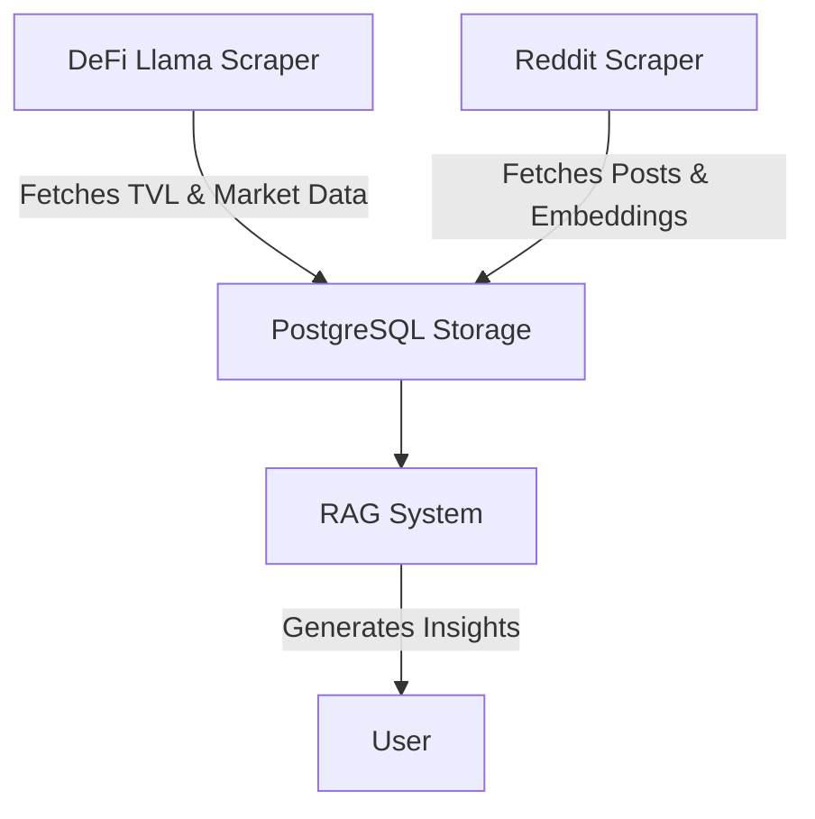

# Crypto Data Engineering

This repository contains tools for collecting, processing, and analyzing cryptocurrency data from various sources.

## Features

- **DeFi Llama Integration**: Fetches Total Value Locked (TVL) metrics for blockchain networks
- **CoinMarketCap Integration**: Retrieves market data including prices, volumes, and market caps
- **Reddit Data Scraping**: Collects posts from cryptocurrency subreddits with OpenAI embeddings
- **PostgreSQL Storage**: Structures and stores data in a PostgreSQL database
- **Automated Workflows**: Uses GitHub Actions for scheduled data collection

## Components

### 1. DeFi Llama Data Pipeline

The DeFi Llama pipeline collects TVL data and market metrics:

- **DefiLlama_scraper.py**: Fetches data from DeFi Llama and CoinMarketCap APIs
- **DefiLlama_to_postgresql.py**: Uploads processed data to PostgreSQL
- **check.py**: Verifies data quality and database connectivity

### 2. Reddit Data Pipeline

The Reddit pipeline collects and analyzes cryptocurrency discussions:

- **Reddit_scraper.py**: Fetches posts from r/cryptocurrency and generates embeddings
- Supports both normal and mock mode for testing

### 3. Conversational RAG System

The Retrieval-Augmented Generation (RAG) system provides AI-powered cryptocurrency insights:

- **RAG.py**: Original implementation that retrieves and presents data
- **improved_RAG.py**: Enhanced version that generates conversational responses
- Uses OpenAI to create natural language answers based on retrieved data
- Combines structured market data with relevant Reddit discussions
- Supports mock mode for testing without API calls

## Setup and Installation

1. Clone this repository
2. Install dependencies:
   ```bash
   pip install -r requirements.txt
   ```
3. Create a `.env` file with the following environment variables:
   ```
   # API Keys
   cmc_api_key=your_coinmarketcap_api_key
   REDDIT_CLIENT_ID=your_reddit_client_id
   REDDIT_CLIENT_SECRET=your_reddit_client_secret
   REDDIT_USER_AGENT=your_reddit_user_agent
   OPENAI_API_KEY=your_openai_api_key

   # Database Configuration
   DB_HOST=your_database_host
   DB_PORT=your_database_port
   DB_NAME=your_database_name
   DB_USER=your_database_user
   DB_PASSWORD=your_database_password
   ```

## Usage

### DeFi Llama Data Collection

#### Example: Fetching and Storing TVL Data

1. Run the DeFi Llama scraper to fetch the latest TVL data:
   ```bash
   python DefiLlama_scraper.py
   ```
2. Upload the fetched data to PostgreSQL:
   ```bash
   python DefiLlama_to_postgresql.py
   ```
3. Verify the data integrity and connectivity:
   ```bash
   python check.py
   ```

### Reddit Data Collection

#### Example: Analyzing Cryptocurrency Discussions

1. Run the Reddit scraper to collect posts from cryptocurrency subreddits:
   ```bash
   python Reddit_scraper.py
   ```
2. Use mock mode for testing without API calls:
   ```bash
   python Reddit_scraper.py --mock
   ```

### Conversational Crypto Assistant

#### Example: Generating Insights with RAG

1. Run the improved RAG system to generate insights based on a query:
   ```bash
   python improved_RAG.py --query "Bitcoin"
   ```
2. Test the system in mock mode:
   ```bash
   python improved_RAG.py --mock --query "Ethereum"
   ```

## Automated Workflows

This repository includes GitHub Actions workflows that run on a schedule. To enable them:

1. Add all required secrets to your GitHub repository
2. The workflows will run automatically every 6 hours
3. You can also trigger them manually from the Actions tab

## Recent Improvements

- **Modular Code Design**: Refactored code into small, testable functions
- **Enhanced Error Handling**: Added robust error handling with informative messages
- **Proper Logging**: Implemented structured logging throughout the codebase
- **Data Validation**: Added data validation to ensure quality
- **Connection Management**: Improved database connection handling
- **Upsert Strategy**: Changed from replace to upsert to preserve historical data
- **Documentation**: Added comprehensive code comments and user documentation

## Contributing

Contributions are welcome! Please feel free to submit a Pull Request.

# Project Goal

The primary goal of this project is to provide a comprehensive data engineering solution for collecting, processing, and analyzing cryptocurrency data from various sources. By integrating multiple data pipelines, the project aims to offer insights into market trends and discussions, enhancing decision-making for cryptocurrency enthusiasts and analysts.

# Visual Aids



# Detailed Examples

## DeFi Llama Data Collection

### Example: Fetching and Storing TVL Data

1. Run the DeFi Llama scraper to fetch the latest TVL data:
   ```bash
   python DefiLlama_scraper.py
   ```
2. Upload the fetched data to PostgreSQL:
   ```bash
   python DefiLlama_to_postgresql.py
   ```
3. Verify the data integrity and connectivity:
   ```bash
   python check.py
   ```

## Reddit Data Collection

### Example: Analyzing Cryptocurrency Discussions

1. Run the Reddit scraper to collect posts from cryptocurrency subreddits:
   ```bash
   python Reddit_scraper.py
   ```
2. Use mock mode for testing without API calls:
   ```bash
   python Reddit_scraper.py --mock
   ```

## Conversational Crypto Assistant

### Example: Generating Insights with RAG

1. Run the improved RAG system to generate insights based on a query:
   ```bash
   python improved_RAG.py --query "Bitcoin"
   ```
2. Test the system in mock mode:
   ```bash
   python improved_RAG.py --mock --query "Ethereum"
   ``` 