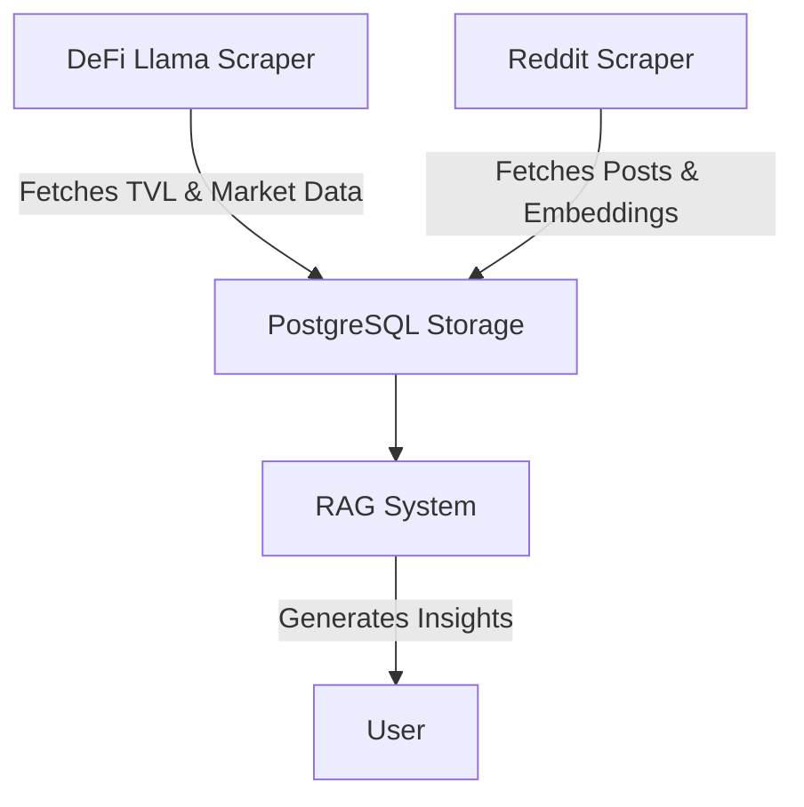

# Crypto Data Engineering

This repository contains tools for collecting, processing, and analyzing cryptocurrency data from various sources.

## Features

- **DeFi Llama Integration**: Fetches Total Value Locked (TVL) metrics for blockchain networks
- **CoinMarketCap Integration**: Retrieves market data including prices, volumes, and market caps
- **Reddit Data Scraping**: Collects posts from cryptocurrency subreddits with OpenAI embeddings
- **PostgreSQL Storage**: Structures and stores data in a PostgreSQL database
- **Automated Workflows**: Uses GitHub Actions for scheduled data collection

## Components

### 1. DeFi Llama Data Pipeline

The DeFi Llama pipeline collects TVL data and market metrics:

- **DefiLlama_scraper.py**: Fetches data from DeFi Llama and CoinMarketCap APIs
- **DefiLlama_to_postgresql.py**: Uploads processed data to PostgreSQL
- **check.py**: Verifies data quality and database connectivity

### 2. Reddit Data Pipeline

The Reddit pipeline collects and analyzes cryptocurrency discussions:

- **Reddit_scraper.py**: Fetches posts from r/cryptocurrency and generates embeddings
- Supports both normal and mock mode for testing
- **Data Storage**: Unstructured data, such as embeddings, is stored in PostgreSQL using the pgvector extension, allowing for efficient similarity searches and vector operations directly within the database.

### 3. Conversational RAG System

The Retrieval-Augmented Generation (RAG) system provides AI-powered cryptocurrency insights:

- **RAG.py**: Original implementation that retrieves and presents data
- **improved_RAG.py**: Enhanced version that generates conversational responses
- Uses OpenAI to create natural language answers based on retrieved data
- Combines structured market data with relevant Reddit discussions
- Supports mock mode for testing without API calls

## Setup and Installation

1. Clone this repository
2. Install dependencies:
   ```bash
   pip install -r requirements.txt
   ```
3. Create a `.env` file with the following environment variables:
   ```
   # API Keys
   cmc_api_key=your_coinmarketcap_api_key
   REDDIT_CLIENT_ID=your_reddit_client_id
   REDDIT_CLIENT_SECRET=your_reddit_client_secret
   REDDIT_USER_AGENT=your_reddit_user_agent
   OPENAI_API_KEY=your_openai_api_key

   # Database Configuration
   DB_HOST=your_database_host
   DB_PORT=your_database_port
   DB_NAME=your_database_name
   DB_USER=your_database_user
   DB_PASSWORD=your_database_password
   ```
4. Set up PostgreSQL with pgvector extension:
   ```sql
   -- Install the pgvector extension (requires PostgreSQL admin privileges)
   CREATE EXTENSION IF NOT EXISTS vector;
   
   -- Create reddit_embeddings table with vector column
   CREATE TABLE IF NOT EXISTS reddit_embeddings (
       post_id TEXT PRIMARY KEY,
       title TEXT,
       text TEXT,
       score INTEGER,
       num_comments INTEGER,
       created_utc TEXT,
       embedding TEXT,
       embedding_vector vector(1536)
   );
   ```

## Usage

### DeFi Llama Data Collection

#### Example: Fetching and Storing TVL Data

1. Run the DeFi Llama scraper to fetch the latest TVL data:
   ```bash
   python DefiLlama_scraper.py
   ```
2. Upload the fetched data to PostgreSQL:
   ```bash
   python DefiLlama_to_postgresql.py
   ```
3. Verify the data integrity and connectivity:
   ```bash
   python check.py
   ```

### Reddit Data Collection

#### Example: Analyzing Cryptocurrency Discussions

1. Run the Reddit scraper to collect posts from cryptocurrency subreddits:
   ```bash
   python Reddit_scraper.py
   ```
2. Use mock mode for testing without API calls:
   ```bash
   python Reddit_scraper.py --mock
   ```

### Conversational Crypto Assistant

#### Example: Generating Insights with RAG

1. Run the improved RAG system to generate insights based on a query:
   ```bash
   python improved_RAG.py --query "Bitcoin"
   ```
2. Test the system in mock mode:
   ```bash
   python improved_RAG.py --mock --query "Ethereum"
   ```

## Automated Workflows

This repository includes GitHub Actions workflows that run on a schedule. To enable them:

1. Add all required secrets to your GitHub repository
2. The workflows will run automatically every 6 hours
3. You can also trigger them manually from the Actions tab

## Recent Improvements

- **Modular Code Design**: Refactored code into small, testable functions
- **Enhanced Error Handling**: Added robust error handling with informative messages
- **Proper Logging**: Implemented structured logging throughout the codebase
- **Data Validation**: Added data validation to ensure quality
- **Connection Management**: Improved database connection handling
- **Upsert Strategy**: Changed from replace to upsert to preserve historical data
- **Documentation**: Added comprehensive code comments and user documentation

## Contributing

Contributions are welcome! Please feel free to submit a Pull Request.

# Project Goal

The primary goal of this project is to provide a comprehensive data engineering solution for collecting, processing, and analyzing cryptocurrency data from various sources. By integrating multiple data pipelines, the project aims to offer insights into market trends and discussions, enhancing decision-making for cryptocurrency enthusiasts and analysts.

# Visual Aids



# Detailed Examples

## DeFi Llama Data Collection

### Example: Fetching and Storing TVL Data

1. Run the DeFi Llama scraper to fetch the latest TVL data:
   ```bash
   python DefiLlama_scraper.py
   ```
2. Upload the fetched data to PostgreSQL:
   ```bash
   python DefiLlama_to_postgresql.py
   ```
3. Verify the data integrity and connectivity:
   ```bash
   python check.py
   ```

## Reddit Data Collection

### Example: Analyzing Cryptocurrency Discussions

1. Run the Reddit scraper to collect posts from cryptocurrency subreddits:
   ```bash
   python Reddit_scraper.py
   ```
2. Use mock mode for testing without API calls:
   ```bash
   python Reddit_scraper.py --mock
   ```

## Conversational Crypto Assistant

### Example: Generating Insights with RAG

1. Run the improved RAG system to generate insights based on a query:
   ```bash
   python improved_RAG.py --query "Bitcoin"
   ```
2. Test the system in mock mode:
   ```bash
   python improved_RAG.py --mock --query "Ethereum"
   ```

## Testing

### Database Vector Search Testing

To verify that the pgvector extension is properly installed and working:

```bash
# Run the pgvector test script
python test_pgvector.py
```

This script:
1. Checks if the pgvector extension is installed
2. Verifies the table schema has vector columns
3. Tests vector search functionality with a sample query
4. Outputs detailed logs of each step

### Reddit Scraper Testing

```bash
# Run the Reddit scraper tests
python test_reddit_scraper.py
```

## System Requirements

- **Python**: 3.8 or higher
- **PostgreSQL**: 14.0 or higher with superuser privileges (for pgvector installation)
- **pgvector**: 0.4.0 or higher
- **API Access**: CoinMarketCap, Reddit, and OpenAI accounts with API keys
- **Memory**: Minimum 4GB RAM recommended for vector operations

## File Structure

```
.
├── .github/workflows/           # GitHub Actions workflow configuration
│   ├── crypto_data_pipeline.yml # Workflow for DeFi Llama pipeline
│   └── reddit_scraper.yml       # Workflow for Reddit pipeline
├── DefiLlama_scraper.py         # Fetches blockchain TVL and market data
├── DefiLlama_to_postgresql.py   # Stores DeFi data in PostgreSQL
├── DefiLlama_mock.py            # Mock version for testing without API calls
├── Reddit_scraper.py            # Fetches Reddit posts and generates embeddings
├── test_reddit_scraper.py       # Tests for Reddit scraper functionality
├── RAG.py                       # Original Retrieval-Augmented Generation system
├── improved_RAG.py              # Enhanced conversational RAG system
├── check.py                     # Database connectivity and data quality checks
├── test_pgvector.py             # Tests for pgvector functionality
├── confirm_github_ready.py      # Checks if repository is ready for GitHub Actions
├── test_github_secrets.py       # Tests environment variables for GitHub Actions
├── requirements.txt             # Project dependencies
├── .gitignore                   # Git ignore configuration
├── output_data.csv              # Sample DeFi data output
├── reddit_crypto_posts.csv      # Sample Reddit data output
└── README.md                    # Project documentation
```

## Command-line Options

### DefiLlama_scraper.py

```bash
# Basic usage (uses real API)
python DefiLlama_scraper.py

# Mock mode (no API calls)
python DefiLlama_scraper.py --mock

# Specify output file
python DefiLlama_scraper.py --output custom_output.csv

# Specify number of chains to fetch (default: 100)
python DefiLlama_scraper.py --limit 50
```

### Reddit_scraper.py

```bash
# Basic usage (uses real API)
python Reddit_scraper.py

# Mock mode (no API calls)
python Reddit_scraper.py --mock

# Specify subreddit (default: cryptocurrency)
python Reddit_scraper.py --subreddit bitcoin

# Specify time window in hours (default: 24)
python Reddit_scraper.py --hours 48
```

### improved_RAG.py

```bash
# Query with real API calls
python improved_RAG.py --query "Bitcoin price prediction"

# Mock mode (no API calls)
python improved_RAG.py --mock --query "Ethereum gas fees"

# Specify number of Reddit posts to retrieve (default: 3)
python improved_RAG.py --query "Solana" --posts 5
```

### test_pgvector.py

```bash
# Run pgvector integration tests
python test_pgvector.py
```

## Troubleshooting

### pgvector Installation Issues

**Issue**: Error when creating the vector extension
```
ERROR: could not open extension control file: No such file or directory
```

**Solution**: 
```sql
-- Install the PostgreSQL development packages first
sudo apt-get install postgresql-server-dev-14

-- Then clone and install pgvector
git clone https://github.com/pgvector/pgvector.git
cd pgvector
make
make install
```

### Database Connection Issues

**Issue**: "Error connecting to the database"

**Solution**: 
- Verify that PostgreSQL is running: `pg_isready`
- Check your `.env` file for correct credentials
- Ensure the database exists: `psql -c "SELECT 1" -d your_database_name`

### API Rate Limiting

**Issue**: "API rate limit exceeded" errors

**Solution**:
- CoinMarketCap: Upgrade your plan or reduce request frequency
- Reddit: Implement exponential backoff in your requests
- OpenAI: Add retry logic with increasing delays

### Vector Search Not Working

**Issue**: Vector similarity search returns incorrect results

**Solution**:
- Verify pgvector extension: `SELECT * FROM pg_extension WHERE extname = 'vector'`
- Check embedding dimensions match (should be 1536 for OpenAI)
- Ensure embeddings are properly cast to vector type

## Advanced Usage

### Creating a Vector Index

For large datasets, create an index to speed up similarity searches:

```sql
-- Create an index on the embedding_vector column
CREATE INDEX ON reddit_embeddings USING ivfflat (embedding_vector vector_cosine_ops) WITH (lists = 100);

-- For even better performance with larger datasets:
CREATE INDEX ON reddit_embeddings USING hnsw (embedding_vector vector_cosine_ops) WITH (m = 16, ef_construction = 64);
```

### Batch Processing

For processing large amounts of data:

```python
# Process Reddit posts in batches of 50
python Reddit_scraper.py --batch_size 50 --total 1000
```

## Dockerized Setup

This project can be run using Docker and Docker Compose for easy setup and reproducibility. The included automation script makes it simple to get started.

### Prerequisites

- Docker and Docker Compose installed on your system
- Git for cloning the repository

### Quick Start

1. Clone the repository:
   ```bash
   git clone https://github.com/yourusername/crypto-data-engineering.git
   cd crypto-data-engineering
   ```

2. Run the setup script:
   ```bash
   ./setup.sh start
   ```
   This will:
   - Create a default `.env` file (update with your API keys)
   - Build and start the Docker containers
   - Set up the PostgreSQL database with pgvector extension

3. Run components using the setup script:
   ```bash
   # Run DeFi Llama scraper
   ./setup.sh defi
   
   # Run Reddit scraper
   ./setup.sh reddit
   
   # Run RAG system with a query
   ./setup.sh rag "Bitcoin price trends"
   ```

### Running in Mock Mode

Test the application without using real API calls:

```bash
# Run all components in mock mode
./setup.sh mock-all

# Run individual components in mock mode
./setup.sh defi --mock
./setup.sh reddit --mock
./setup.sh rag --mock --query "Ethereum"
```

### Useful Commands

```bash
# View container logs
./setup.sh logs

# Stop containers
./setup.sh stop

# Restart containers
./setup.sh restart

# Remove all containers and volumes
./setup.sh clean

# View help message
./setup.sh help
```

## Manual Setup and Installation

If you prefer not to use Docker, follow these steps for manual installation: 